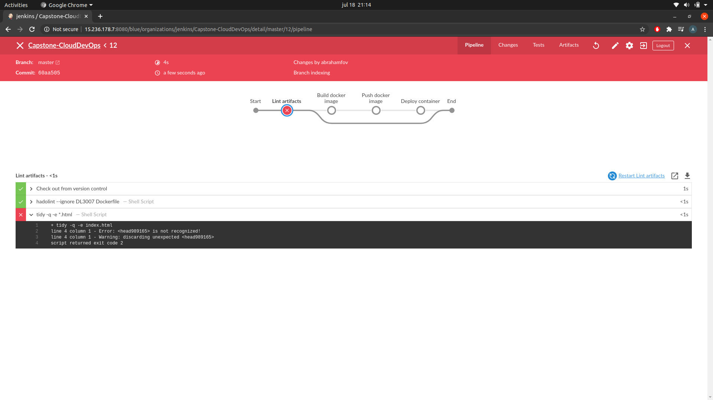

## Cloud DevOps nanodegree: Capstone project
### Project Overview
In this project, the skills developed throughout the Cloud DevOps Nanodegree program will be tested:

* Working in AWS
* Using Jenkins to implement Continuous Integration and Continuous  Deployment
* Building pipelines
* Working with Ansible/CloudFormation to deploy clusters
* Building Kubernetes clusters
* Building Docker containers in pipelines

### Setting AWS infrastructure
To create the EKS cluster:
`cd Infrastructure/`
`make kubernetes-cluster`

### Linting stage check
* Dockerfile linting error:

* HTML file linting erro:

* Linting OK:

### Jenkins server
A Jenkins server was allocated within a EC2 instance, and an elastic IP was addressed to it:

### EC2 Instances
There were generated 4 EC2 instances. One of them was the Jenkins server and the rest were part of the EKS cluster:

